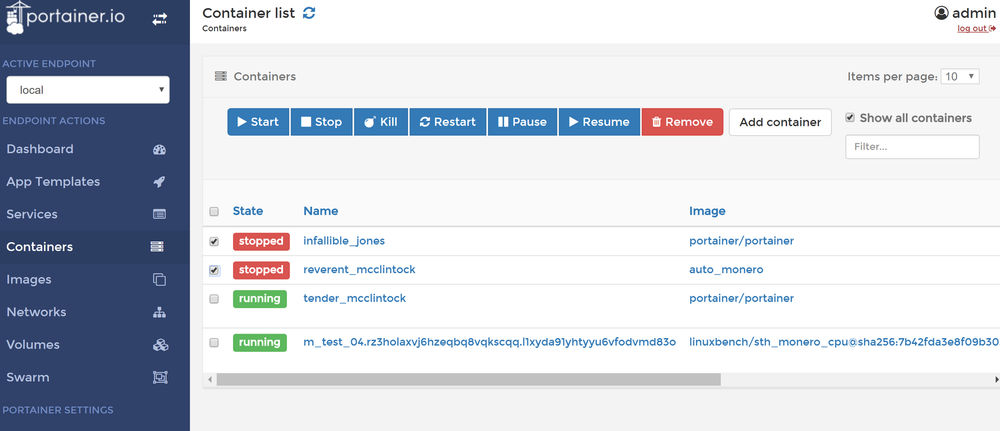

Today, it is quite possible to consume the internet passively and get just about any service you want without a tinker. A blog on blogger.com, a cheap website at ovh, a cloud service on google drive and even your own web applications. But if you're like me and like to host everything by yourself, I'll show you, step by step and in a detailed way, how to set up your own multi-function swiss army knife server in a few steps.<!--more-->

This server will have to meet various criteria, first of all in a global way:

* Able to accommodate all our services.
* Easy to configure: you don't want to spend hours updating it or changing the hardware.
With the least amount of fiddling around: we want to use widespread tools and with a large community behind it.
* Lightweight: the infrastructure that maintains the server should not have to take up half of its resources by itself.
* Secure: even if we are not security experts, we don't want the server to be a sieve.
* Backed up: nothing is infallible and even if you are not looking for a 99.9% SLA, you would still like to be able to easily rebuild your server in case of failure.

In a more technical way, today's technologies also impose the use of dockers (even if there are other less widespread solutions). But other criteria come to my mind:

* The server will only expose its port 443 to the public. With the current times, HTTPS is becoming more and more obvious and since it has become extremely simple and free to order a certificate, we might as well not deprive ourselves of it.
* Speaking of certificates, all this will be automatic. We're not going to order our certificates ourselves either.
* The server will be able to host several domains and sub-domains. Each application will be linked to one of these urls.
* Finally, since we are not going to set up a single-core server, it will have to be "load-balanced", i.e. be able to route an entry point on several copies of the same service to ensure the scalability. And why not on another server, later.

## Kubernetes
You may know or have already heard of *Kubernetes*. It's a container orchestrator that makes the coffee, as it is able to deploy applications in 3 clicks thanks to *Helm*. It is an extremely powerful tool but for several reasons, not recommended if you follow this tutorial.

* It requires the use of two fairly resource-intensive services: etcd (the kube data) and control plane (the control towers). And it doesn't meet one of our criteria: lightness.
* Kubernetes is complex. On its own, it requires many hours of practice before it can be mastered, and that's without counting on its 3 major updates that come out every year.
* It requires redundancy: by nature, since it is complex, it requires a great deal of mastery so as not to miss its configuration. Large periods of "work in progress" will therefore be expected if you plan to keep only one server.
* It has been designed in its deepest roots to handle scaling. That is to say, the rapid rise in power. However, we're moving towards a single server, maybe a second one one one day... So we'll have time to think about it.

In short, *Kubernetes* is really fun, believe me, it's very probably the future of the next 10 years of the professional IT world, but for a personal project, at the time I'm writing these lines, it's a bit too powerful.

## Architecture
Our server will therefore be a simple machine with docker containers that communicate with each other. Just that. And in fact, you'll see that's more than enough. Docker already virtualizes the whole network part, so if you don't explicitly expose a port to the outside, it will remain inaccessible (even for you). On the security side, we have about nothing to do. Then, docker has reboot rules. If the docker stops for any reason, it can be automatically restarted. Finally, docker alone, well, it's extremely powerful. See by yourself the fire velocity of this blog :)

### Traefik
As explained earlier, the server will only expose its port 443. We will avoid mounting a nginx server with a lot of configuration behind it to route traffic. No honestly, believe me, you don't want to bother with that. So the idea is to let a tool do the work for you. And the king, sorry, I meant the jedi master in this field, it's *Traefik*. Traefik is a router (or *reverse proxy* if you prefer) that connects your web addresses to your web services. It automatically discovers the containers and exposes them itself. It also does load-balancing, fetches its certificates by itself from Let's Encrypt (while managing the auto-renewal); and of course, it does it all by itself, without any intervention (except a few labels to add to your containers). And as if all that wasn't enough, he really consumes very few resources.

*Traefik architecture (©Traefik)*

### Portainer
Traefik is there to route but how to administrate? When you have a lot of docker containers, you can always run a small `docker ps` to display a list of your containers or a `docker volume ls` for your volumes. Etc... Except that well, we're not really in the simplicity I promised you.

That's where *Portainer* comes in. Portainer adds a layer of abstraction to docker through a web interface. The latter allows you to do everything you would do through command lines but in a few clicks such as updating your containers, configuring volumes, loading deployment files, etc.

*Small preview of Portainer with its buttons to manage containers.*

## Pour résumer

*Target architecture of our server*

We saw that it was possible to set up your own server all clean using *Traefik* for the connection between "front" through the HTTPS/443 port and the containers and to administer it using *Portainer*. All that's left to do is to get started.

In the next parts, we will see :

- Which machine for this kind of project?
- Prerequisites and installation of the base
- Deployment of the first containers (Traefik and Portainer)
- Traefik's configuration through dock container labels
- Where to put your data?
- Save!

Finally, we will see how to automate the deployment of this kind of server so that we don't have to do it again later (in case of failure for example).

