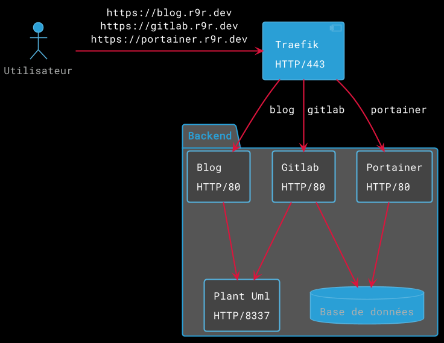

Aujourd'hui, il est tout à fait possible de consommer internet de manière passive et d'obtenir à peu près tous les services que l'on souhaite sans bidouille. Un blog sur blogger.com, un site web pour pas trop cher chez ovh, un service de cloud sur google drive et même ses propres applications web. Mais si vous êtes comme moi et aimez vouloir héberger tout par vous même, je vais vous présenter, pas à pas et de manière détaillée, comment monter votre propre serveur couteau-suisse multi-fonctions en quelques étapes.<!--more-->

Ce serveur devra répondre à divers critères, tout d'abord de manière globale:

* Capable d’accueillir tous nos services.
* Facile à configurer : on ne veut pas y passer des heures à le mettre à jour ou à changer le hardware.
Avec le moins de bidouille possible : on souhaite utiliser des outils répandus et avec une communauté conséquente derrière.
* Léger : il ne faudrait pas que l'infrastructure qui maintiens le serveur prenne à lui tout seul la moitié de ses ressources.
* Sécurisé : même si on est pas des experts en sécurité, on souhaite que le serveur ne soit pas une passoire.
* Sauvegardé : rien n'est infaillible et même si pour du perso, on ne cherche pas un SLA de 99,9%, on aimerait quand même pouvoir remonter facilement son serveur en cas de panne.

De manière plus technique, les technologies d'aujourd'hui nous imposent également l'utilisation de docker (même s'il existe d'autres solutions moins répandues). Mais d'autres critères me viennent à l'idée :

* Le serveur exposera uniquement son port 443 au public. Avec les temps qui courent, l'HTTPS devient de plus en plus évident et puisqu'il est devenu extrêmement simple et gratuit de commander un certificat, autant ne pas s'en priver.
* En parlant de certificat, tout cela sera automatique. On ne va quand même non plus aller commander nos certificats nous-mêmes.
* Le serveur sera capable d’accueillir plusieurs domaines et sous-domaines. Chaque application se rattachant à une de ces urls.
* Enfin, puisqu'on est pas partis pour monter un serveur mono-core, il devra pouvoir être "load-balancé", c'est à dire être capable de router un point d'entrée sur plusieurs copies d'un même service pour assurer la montée en charge. Et pourquoi pas sur un autre serveur, plus tard.

## Kubernetes
Vous connaissez peut-être ou avez déjà entendu parler de *Kubernetes*. C'est un orchestrateur de conteneurs qui fait carrément le café puisqu'il est capable de déployer des applications en 3 clics grâce à *Helm*. C'est un outil extrêmement puissant mais pour plusieurs raisons, peu recommandable si vous suivez ce tutoriel.

* Il nécessite l'emploi de deux services assez rapidement gourmands en ressources : etcd (les données du kube) et control plane (les tours de contrôle). Et ça ne réponds pas à un de nos critères : la légèreté (ok, depuis il existe micro-k8s).
* Kubernetes est complexe. A lui tout seul, il nécessite de nombreuses heures de pratique avant de pouvoir être maîtrisé, et c'est sans compter sur ses 3 mises à jour majeures qui sortent par an.
* Il nécessite de la redondance : par nature, étant donné qu'il est complexe, il faut une grande maîtrise pour ne pas se rater sur sa configuration. De grandes périodes de "en travaux" seront donc à prévoir si vous prévoyez de ne conserver qu'un seul serveur.
* Il a été conçu dans ses plus profondes racines pour gérer le scaling. C'est à dire, la montée en puissance rapide. Hors, nous partons vers un mono-serveur, peut-être un deuxième un jour... On aura donc le temps d'y repenser.

Bref, *Kubernetes* c'est vraiment le fun, croyez-moi, c'est très probablement l'avenir des 10 prochaines années du monde informatique professionnel, mais pour un projet perso, à l'heure où j'écris ces lignes, c'est un peu trop puissant.

## Architecture
Notre serveur ne sera donc qu'une simple machine avec des conteneurs docker qui communiquent entre-eux. Juste ça. Et en fait, vous verrez que ça suffit largement. Docker virtualise déjà toute la partie réseau ce qui fait que si vous n'exposez pas explicitement un port sur l'extérieur, il restera inaccessible (même pour vous). Côté sécurité, on a donc environ rien à faire. Ensuite, docker possède des règles de redémarrage. Si le docker s'arrête pour une raison ou pour une autre, il pourra être automatiquement redémarré. Enfin docker tout seul, bah c'est extrêmement performant. Constatez par vous-même la vélocité de feu de ce blog :)

### Traefik
Comme expliqué plus tôt, le serveur n'exposera que son port 443. On va éviter de monter un serveur nginx avec plein de configuration derrière pour router le trafic. Non franchement, croyez-moi, vous n'avez pas envie de vous ennuyer avec ça. Du coup, l'idée est de laisser un outil faire le travail à votre place. Et le roi, pardon, je voulait dire le maître jedi dans ce domaine, c'est *Traefik*. Traefik, c'est un routeur (ou *reverse proxy* si vous préférez) qui connecte vos adresses web à vos services web. Il découvre de manière automatisée les conteneurs et les expose lui-même. Il fait aussi load-balancing, va chercher ses certificats tout seul chez Let's Encrypt (tout en gérant le renouvellement auto) ; et bien sûr, il fait tout ça tout seul, sans aucune intervention (hormis quelques labels à ajouter à vos conteneurs). Et comme si tout ça ne suffisait pas, il consomme vraiment très peu de ressources.

*L'architecture de Traefik (©Traefik)*

### Portainer
Traefik est là pour router mais comment administrer ? Lorsque vous aurez tout plein de conteneurs dockers, vous pourrez toujours exécuter un petit `docker ps` pour afficher une liste de vos conteneurs ou un `docker volume ls` pour vos volumes. Etc... Sauf que bon, on est pas vraiment dans la simplicité que je vous avait promise.

C'est là que *Portainer* entre en scène. Portainer ajoute une couche d'abstraction à docker à travers une interface web. Cette dernière permet de faire tout ce que vous ferriez à travers des lignes de commandes mais en quelques clics comme mettre à jour vos conteneurs, configurer les volumes, charger des fichiers de déploiement, etc.

*Petit aperçu de Portainer avec ses boutons pour gérer les containers.*

## Pour résumer

*L'architecture cible de notre serveur*

Nous avons vu qu'il était possible de monter son propre serveur tout propre en utilisant *Traefik* pour la liaison entre "front" à travers le port HTTPS/443 et les conteneurs et de l'administrer en utilisant *Portainer*. Ne reste plus qu'à se lancer.

Dans les prochaines parties, nous verrons :

- Quel machine pour ce genre de projet ?
- Les prérequis et l'installation du socle
- Déploiement des premiers conteneurs (Traefik et Portainer)
- La configuration de Traefik au travers des labels de conteneurs docker
- Où mettre ses données ?
- Sauvegarder !

Enfin, nous verrons comment automatiser le déploiement de ce genre de serveur afin de ne plus avoir à le refaire plus tard (en cas de panne par exemple).

