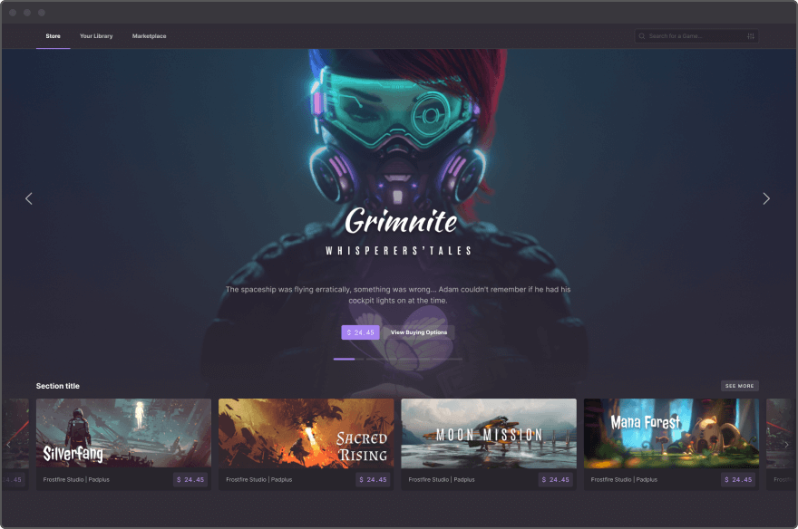

Si vous ne connaissez pas [Ultra](https://ultra.io/), je suppose que vous êtes entrain de vous dire que j'ai fumé quelque chose de puissant pour oser vous dire qu'une plateforme Gaming va sans doute bientôt faire concurrence à Steam et que c'est très sérieux. Vous me diriez que d'autres sont déjà passé par là et qu'ils se sont soit cassé les dents, soit n'ont jamais décollé.

Vous avez sans doute raison de me prendre pour un fou mais s'il vous plait, lisez tout de même ce que j'ai à vous dire car avec Ultra, je crois qu'on est juste pas prêts.

## La concurrence

Avant de commencer, un rapide petit tour d'horizon s'impose. On peut séparer les revendeurs de jeux en deux catégories. Les vendeurs neutres comme Steam, Epic Games ou GOG qui certes ont un studio de développement derrière (Valve, CD Projekt) mais qui vendent absolument tout à condition de prendre une commission (le cas d'Epic étant un peu à part). Et les vendeurs mégalo qui ont créé leur propre boutique comme Ubisoft, EA ou encore Activision-Blizzard.

Ce qui est assez fou, c'est que Steam est arrivé le premier et a très rapidement proposé de nombreuses fonctionnalités. Et les concurrents ne sont jamais parvenus à le détroner car ils n'ont jamais proposé plus que ce que proposait déjà Steam. Epic Games a préféré bruler son argent en masse pour attirer les studios car il n'avait sans doute pas d'autre choix. En l'occurence, la plateforme ponctionne 12% des ventes là ou les concurrents en ponctionnent 30%.

Ce que j'essaye d'expliquer c'est que développer une plateforme de jeux-vidéo, c'est long et c'est extrêmement complexe.

Pourtant, vous allez voir que Ultra a déjà tout ça et surtout bien plus.

## Ultra is Life

Ultra est donc une plateforme identique à Gog ou Steam. Elle permettra d'acheter et de jouer à des jeux-vidéos et leur site explique grossièrement ce qu'il sera possible de faire avec leur plateforme. Mais que peuvent-ils proposer que Steam ne proposerait pas déjà ?

### Le marché de l'occasion

La première et pour moi la killer-feature : le marché de l'occasion. Si vous avez un peu suivi l'actualité, Steam s'est fait condamné en Europe car ils ne permettaient pas le marché de l'occasion. Ils ont fait appel et cela pourrait encore durer quelques années mais à terme, ils n'auront plus le choix. Ils devront permettre aux joueurs de revendre leurs jeux.

Ce sera dans l'ADN d'Ultra de permettre le marché de l'occasion. Et cela ne se limitera ni aux jeux, ni à la plateforme elle-même. Sur Ultra, vous pourrez non seulement acheter d'occasion et revendre d'occasion mais vous pourrez revendre tout ce que les développeurs vous auront permis de revendre. DLCs, items en jeu, mods, et même abonnement, tout ce qui se trouve sur Ultra est un bien numérique indépendant qui sera en la possession d'un joueur dans une sorte de portefeuille numérique. En gros, c'est un peu comme si vous aviez votre jeu sur votre étagère dans votre salon.

Un bien numérique pourra donc être revendu sur la plateforme mais pas que. Vous pourrez très bien envoyer votre jeu ou votre skin directement à un autre joueur. Ultra ne servant que d'intermédiaire.

Pour attirer les studios, Ultra a mis en place un système de taxes. Pour faire simple, le studio qui possède un jeu établira les règles de tous ses biens-numériques. Si bien que si vous souhaitez vendre un jeu, un pourcentage sera reversé au studio de développement. Idem si vous souhaitez le donner un ami, vous devrez tout de même payer une taxe. Sinon évidement, avec internet, ce serait un peu trop facile.

### Une copie physique

La technologie derrière Ultra pourra permettre une inter-compatibilité. Ce qui est annoncé c'est que (toujours selon le bon vouloir du studio), si vous achetez un jeu, il vous appartient. Il est *un peu comme si* vous aviez le jeu physiquement avec vous. Ainsi, vous pourriez utiliser votre jeu pour jouer sur différentes plateformes sans avoir à le repayer.

Mais cela va même un peu plus loin. La technologie derrière Ultra permet de ne pas avoir besoin d'Ultra pour fonctionner. Ça vous parait fou ? Moi aussi. En gros, votre bibliothèque de bien numériques est inscrite dans le marbre et même si Ultra ne fonctionnait pas votre bien lui serait toujours là. Comme une sorte de document qui fait office de preuve d'achat.

Cela permet plein d'autres choses. Par exemple, Ultra pourrait permettre d'avoir une seconde plateforme, indépendante de la sienne, qui appartiendrai entièrement à un Studio de grande envergure. La société derrière Ultra a déjà un partenariat avec Ubisoft. Nous pourrions donc tout à fait imaginer acheter un jeu sur Ultra ou sur Uplay et de le voir disponible sur les deux plateformes. En effet, vous disposez du jeu alors pourquoi ne pourriez-vous pas y jouer indépendament de la plateforme sur laquelle vous l'avez acheté ? Bien sûr, rien de tout ça n'a été annoncé par Ultra aujourd'hui mais technologiquement parlant, c'est tout à fait possible (et ce serait extrêmement simple pour Ultra à développer).

### Une monnaie : Le UOS

Ultra sera donc basé sur une technologie de bien numériques. Pour s'échanger ces biens de manière rapide et efficace, une monnaie propre à la plateforme évitera les conversions en euro ou en dollar et évitera aussi de passer par les banques. Votre compte sera donc crédité en *UOS* (1 UOS équivaut à 0,31€ à l'heure où j'écris cet article) et vous pourrez acheter d'autres bien avec ces UOS. Bien sûr, il sera tout à fait possible de sortir les UOS de la plateforme pour ensuite les convertir en € (moyennant d'autres taxes indépendantes d'Ultra mais liées à la législation française).

Mais ce que permettra cette monnaie, c'est surtout que vous pourrez en obtenir de différentes manières. Vous pourrez être rémunéré en UOS directement dans un jeu, vous pourrez même utiliser les ressources de votre machine pour gagner les UOS et ainsi à terme vous achetez vos jeux contre un peu de watt-chauffage. Aussi, plus la plateforme Ultra sera populaire, plus l'UOS prendra de la valeur et ainsi, permettra d'augmenter la valeur de son pouvoir d'achat numérique.

Il est déjà possible d'acheter des UOS aujourd'hui mais ce n'est pas l'objet de l'article.

### Le streaming

La plateforme Ultra proposera un onglet de streaming exactement comme le propose Twitch aujourd'hui. C'est un peu comme si Steam proposait un onglet *Twitch*. Pour cela, Ultra a établi un partenariat avec [THETA](https://www.theta.tv/). Une plateforme qui malheureusement a environ la popularité de Mixer à son époque mais qui proposera aux streamers **et** aux viewers d'être lentement mais surement rémunérés en utilisant la plateforme. Difficile de savoir si ce genre de plateforme deviendra populaire à terme mais la fonctionnalité sera là.

## Conclusion

Vous l'aurez sans doute deviné, Ultra est basé sur une *blockchain*. Grosso-modo, ils sont basés sur des technologies similaires au Bitcoin. Le réseau Bitcoin ayant largement fait ses preuves aujourd'hui, c'est un système extrêmement robuste et surtout décentralisé. Une personne détenant des bitcoins les détiens sur son portefeuille à lui et personne ne peut y accéder sans son accord. En plus d'un équivalent aux bitcoins, Ultra permet de mettre des bien numériques dans son portefeuille (on les appelle des NFT) et de la même manière, si vous en êtes le propriétaire, vous en serez de la même manière que votre cartouche de jeu gameboy.

Plus d'informations sur Ultra :
- Le site internet : https://ultra.io/
- Twitter : https://twitter.com/ultra_io et https://twitter.com/Ultra_platform
- Le canal Telegram : https://t.me/ultra_io
- Le serveur discord : http://discord.gg/9EUPGrW

